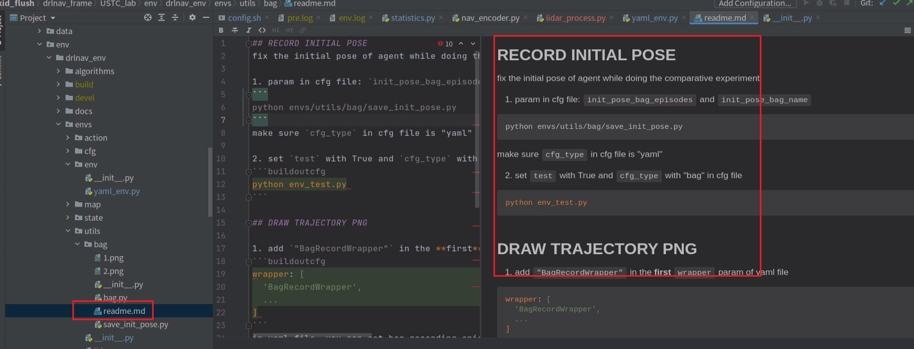

## 框架使用手册

#### Q: 训好模型后，如何出paper里面的对比数据？

A:

做对比实验，要保证前后对比的方法，每次的环境配置是相同的，即每个episode的障碍物数量，位置，机器人起终点位置等相同，所以我们采用录bag的方式，将这些值记录下来。然后再测试的时候，就用bag里的初始值跑。

具体文档：`drlnav_frame/USTC_lab/env/drlnav_env/envs/utils/bag/readme.md` RECORD INITIAL POSE 部分

#### Q: paper里的轨迹图怎么画？

A:

原理上将测试时机器人和行人的行动轨迹记录下来，存成bag，在启动相关脚本进行读取绘制

具体使用文档：`drlnav_frame/USTC_lab/env/drlnav_env/envs/utils/bag/readme.md` DRAW TRAJECTORY PNG 部分

根据个人需求，也许还需要修改 `drlnav_frame/USTC_lab/env/drlnav_env/envs/utils/bag/bag.py`

