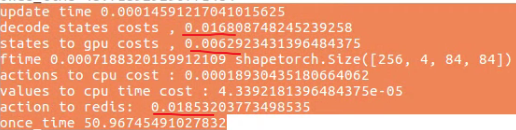
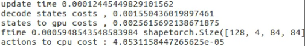
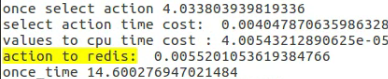
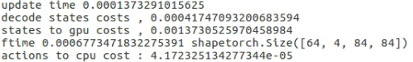
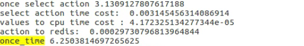
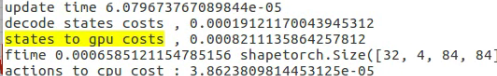
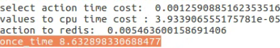

### 框架 forward 为啥那么慢

测试环境： 3090+i7-10700k+64G Mem

| process | batch_env | time(s)/128step | cpu cost % | forward time(ms)/ step |
| ------- | --------- | --------------- | ---------- | ---------------------- |
| 32      | 8         | 7.6-8           | 55         | **20**                 |
| 64      | 8         | 15-16           | 55         | **48**                 |
| 16      | 8         | 4.5             | 60         | 11                     |
| 16      | 4         | 2.8             |            |                        |
|         |           |                 |            |                        |

#### 一次batch前向分析：

 如下图 [256, 4, 84,84]

上图补充选择动作大概7-8ms。

 [128, 4, 84,84]

结论是to gpu的时间和tensor大小成正比，而解码的时间比 [256, 5, 84,84]的省了10倍，原因是进程数量少的话，有更多的cpu资源供解码，解决方案是**某个进程固定用多少个cpu资源**。

 [8*8, 4, 84,84]

 [8*4, 4, 84,84]

结论：在cpu够用的情况下，解码时间和数据大小成正比。

假设解码时间**不能优化**

需要优化的地方：

- 可以看到动作写入redis的时间占了1/3以上，尝试换消息队列
- 选择动作的8ms 占了1/5左右，**可以用numpy批量操作还不是用for循环**。
- 进程数量增多后，解码时间显著边长，解决方案是**predict进程固定足够的cpu资源 | 控制env 进程数量**

### 最终结论

1. env进程和核心数相同最好，最好是提高batch_env的数量
2. 更改消息队列模式，降低因为redis顺序写入造成的延迟。

其他时间记录：

pytorch 前向时间记录，

[256,4,84,84] float32

cpu： 15ms

3090:  0.6ms

