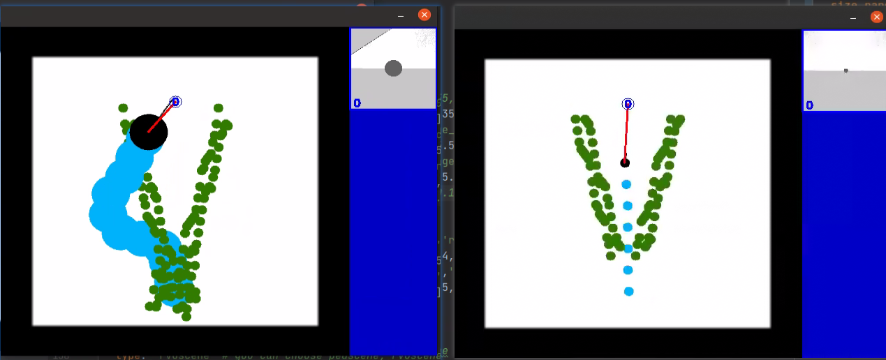
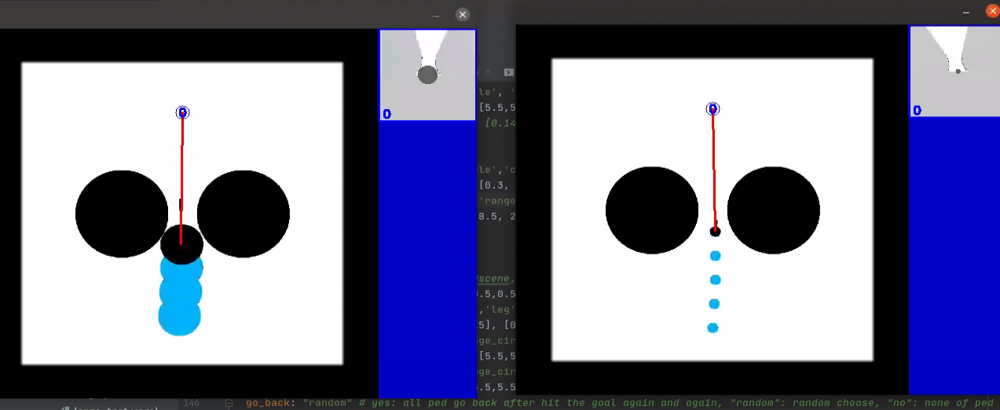
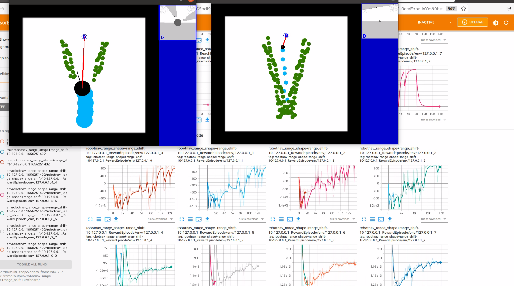

### 多样性策略

#### 目的：

- 针对自己的形状，可以做不同的决策。如1图大形状应该绕开，小形状从中间走。

#### 坑

- **而如果就在测试集训练，即场景固定，会导致策略非常容易过拟合，只学会固定的一种策略。**

测试1：

以下左右两个机器人大小固定，各4个环境，同时训，学出来的策略就是固定的，要么都往中间走，要么都绕开。

同理动态环境依然只学会从中间走，改reward会导致2种大小机器人都从外边绕：

 

#### 解决方案

静态场景下训练，不要固定场景，而是随机场景，让agent不过拟合。

通过实验证明静态场景下训练的robot也可以在动态场景下有用。

